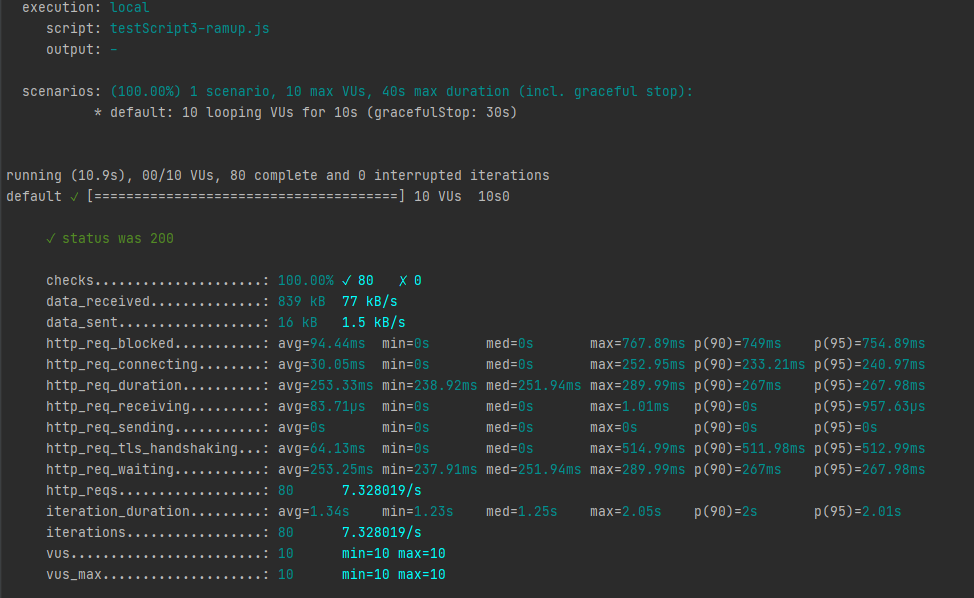

# Docs links
https://k6.io/docs/

# Setup
https://k6.io/docs/getting-started/installation

# Demo 1 - Hello
https://k6.io/docs/getting-started/running-k6

### Chạy ứng dụng cơ bản:
```
k6 run 1_hello.js
```

Nâng số lượng virtual user và chạy trong 30s:
````
k6 run --vus 10 --duration 30s 1_hello.js
````

### Sử dụng cấu hình được set trong script test
https://k6.io/docs/using-k6/options
````
k6 run 3_option.js
````
### Các đọc dữ liệu:



| Name | Description |
|---|---|
| execution | Có 2 mode là local (Chạy trên máy hoặc server) và cloud (Chạy trên dịch vụ cloud của K6). |
| output | Nơi xuất kết quả dữ liệu test, mặc định là `stdout`. |
| script | Tên file test. |
| duration | Thời gian chạy test. |
| iterations | Tổng số lần lặp. |
| vus | Số lượng VU được khởi tạo khi bắt đầu chạy. |
| max | Số lượng VU tối đa trong giai đoạn chạy test. |

### Thông tin metric và các loại dữ liệu:

#### Phân loại metric:
| Name | Description |
|---|---|
| Counter | Được tính tổng từ các giá trị kết quả. |
| Gauge | Được lấy từ max, min, giá trị đầu tiên, cuối cùng của kết quả. |
| Rate | Là giá trị phần trăm. |
| Trend | Giá trị được sử dụng để tính toán ra các dữ liệu thống kê bên trên. |


| Metric Name | Type | Description |
|---|---|---|
| **HTTP-specific built-in metrics**  |   |   |
| http_reqs | Counter | Số http request của một test case |
| http_req_blocked | Trend | Thời gian chờ để có được kết nối đến server (TCP connection slot) |
| http_req_connecting | Trend | Thời gian mở kết nối tới server |
| http_req_tls_handshaking | Trend | Thời gian khởi tạo kết nối bảo mật tới server |
| http_req_sending | Trend | Thời gian gửi khối dữ liệu đến server (liên quan đến đường truyền mạng) |
| http_req_waiting | Trend | Thời gian chờ server xử lý và trả lại kết quả |
| http_req_receiving | Trend | Thời gian cần để lấy được đủ khối dữ liệu trả về của 1 response kể từ lúc server bắt đầu trả kết quả |
| http_req_duration | Trend | = http_req_sending + http_req_waiting + http_req_receiving |
| **Built-in metrics** |  |  |
| vus | Gauge | số lượng active VU |
| vus_max | Gauge | Số lương active VU tối da trong đợt test |
| iterations | Counter | Số test script được chạy lặp lại (Chắc để lấy trung bình) |
| iteration_duration | Trend | Tổng thời gian thực thi bộ test với x lần lặp |
| dropped_iterations | Counter | Số bộ test thực thi không đảm bảo do lỗi hoặc quá thời gian thực thi |
| data_received | Counter | Khối lượng data đã nhận |
| data_sent | Counter | Khối lượng data đã được gửi |
| checks | Rate | Tỉ lệ bộ kiểm tra (checks) thành công |

**Accessing HTTP timings from a script**

| PROPERTY | DESCRIPTION |
|---|---|
| res.body | body của dữ liệu trả về |
| res.headers | Object chứa bộ key/value của header |
| res.status | http status |
| res.timings | object containing HTTP timing information for the request in ms |
| res.timings.blocked | = http_req_blocked |
| res.timings.connecting | = http_req_connecting |
| res.timings.tls_handshaking | = http_req_tls_handshaking |
| res.timings.sending | = http_req_sending |
| res.timings.waiting | = http_req_waiting |
| res.timings.receiving | = http_req_receiving |
| res.timings.duration | = http_req_duration |

### Danh sách các cấu hình trong Option
| OPTION | DESCRIPTION |
| --- | --- |
| **[Batch](https://k6.io/docs/using-k6/options#batch)** | Số lượng kết nối đồng thời tối đa của lời gọi `http.batch()` |
| **[Batch per host](https://k6.io/docs/using-k6/options#batch-per-host)** | Số lượng kết nối đồng thời tối đa cho 1 host của lời gọi `http.batch()` (sử dụng trong trường hợp script test được deploy run trên cloud của K6)|
| **[Blacklist IPs](https://k6.io/docs/using-k6/options#blacklist-ips)** | Chặn không cho script truy vấn đến 1 dải IP |
| **[Block hostnames](https://k6.io/docs/using-k6/options#block-hostnames)** | Chặn không scho script truy vấn đến một hostname cụ thể |
| **[Compatibility Mode](https://k6.io/docs/using-k6/options#compatibility-mode)** | Chỉ định script được chạy với chế độ ECMAScript cụ thể |
| **[Config](https://k6.io/docs/using-k6/options#config)** | Cấu hình load các config trong một file config được đặt ở bên ngoài môi trường dạng file là json |
| **[Discard Response Bodies](https://k6.io/docs/using-k6/options#discard-response-bodies)** | Cài đặt là true để bỏ qua không xử lý response body |
| **[DNS](https://k6.io/docs/using-k6/options#dns)** | Cấu hình hành vi trong xử lý DNS |
| **[Duration](https://k6.io/docs/using-k6/options#duration)** | Tổng thời gian test, hết thời gian script tự ngắt |
| **[Execution Segment](https://k6.io/docs/using-k6/options#execution-segment)** | Cấu hình chia nhỏ và scale thông số test theo giai đoạn (??? Cầm làm rõ hơn)|
| **[Extension Options](https://k6.io/docs/using-k6/options#extension-options)** | Các cấu hình của các thu viện của 3rd được lưu trong object này |
| **[Hosts](https://k6.io/docs/using-k6/options#hosts)** | Cấu hình host (giống file host trong windows hoặc linux) |
| **[HTTP Debug](https://k6.io/docs/using-k6/options#http-debug)** | Cấu hình này sẽ log lại tất cả request và response |
| **[Include System Env Vars](https://k6.io/docs/using-k6/options#include-system-env-vars)** | Nếu là true các cấu hình trong options mà có trong biến môi trường của server sẽ được overwrite khi chạy |
| **[Insecure Skip TLS Verify](https://k6.io/docs/using-k6/options#insecure-skip-tls-verify)** | Không kiểm tra tính hợp lệ của https của server cung cấp api|
| **[Iterations](https://k6.io/docs/using-k6/options#iterations)** | Số lần lặp của bộ test nếu được set cùng duration thì duration sẽ được hiểu là thời gian tối đa được phép chạy |
| **[Linger](https://k6.io/docs/using-k6/options#linger)** | Tiến trình chạy script test có exit khi run xong mặc định là thoát |
| **[Local IPs](https://k6.io/docs/using-k6/options#local-ips)** | Dải IP mà các VUs thực hiện request tới |
| **[Log Output](https://k6.io/docs/using-k6/options#log-output)** | Cấu hình log script test (console hoặc log server) |
| **[LogFormat](https://k6.io/docs/using-k6/options#logformat)** | Định dạng log là json hoặc raw |
| **[Max Redirects](https://k6.io/docs/using-k6/options#max-redirects)** | Số lượng redirects mà 1 VU xử lý cho 1 request mặc định là 10  |
| **[Minimum Iteration Duration](https://k6.io/docs/using-k6/options#minimum-iteration-duration)** | Thời lượng chạy test tối thiểu |
| **[No Connection Reuse](https://k6.io/docs/using-k6/options#no-connection-reuse)** | Bật hoặc tắt keep-alive cho 1 kết nối HTTP  |
| **[No Cookies Reset](https://k6.io/docs/using-k6/options#no-cookies-reset)** | Tắt tính năng xóa cookies cho các lần lặp |
| **[No Thresholds](https://k6.io/docs/using-k6/options#no-thresholds)** | Tắt tính đo các ngưỡng được custom trong script |
| **[No Usage Report](https://k6.io/docs/using-k6/options#no-usage-report)** | Không gửi usage report mỗi lần chạy (version, max VUs, duration)  |
| **[No VU Connection Reuse](https://k6.io/docs/using-k6/options#no-vu-connection-reuse)** | Tắt tính năng tái sử dụng lại kết nối TCP của VU giữa các lần lặp |
| **[Paused](https://k6.io/docs/using-k6/options#paused)** | Bật tắt tính năng pause (tạm dừng) khi test trên cloud (K6 cloud) |
| **[Results Output](https://k6.io/docs/using-k6/options#results-output)** | Cấu hình kết quả của bộ test sẽ được đẩy ra đâu (console, grafana(influxDB), ... |
| **[RPS](https://k6.io/docs/using-k6/options#rps)** | Ngưỡng (Số) request tối đa trên giây |
| **[Scenarios](https://k6.io/docs/using-k6/options#scenarios)** | Định nghĩa các cấu hình cho từng trường hợp chạy (giống spring profile) |
| **[Setup Timeout](https://k6.io/docs/using-k6/options#setup-timeout)** | hàm `setup()` được chạy tối đa bao lâu trước khi bị ép tắt |
| **[Stages](https://k6.io/docs/using-k6/options#stages)** | Danh sách cấu hình ramp up hoặc down VUs theo thời gian|
| **[Summary export](https://k6.io/docs/using-k6/options#summary-export)** | Path của file báo cáo tổng hợp dạng json |
| **[Supply Env Var](https://k6.io/docs/using-k6/options#supply-env-var)** | Cấu hình thêm hoặc ghi đè lại biến môi trường |
| **[System Tags](https://k6.io/docs/using-k6/options#system-tags)** | Cấu hình các các metric của system được lấy, thu thập |
| **[Summary Trend Stats](https://k6.io/docs/using-k6/options#summary-trend-stats)** | Cấu hình các loại thống kê kiểu Trend (metric type) sẽ được xử lý |
| **[Tags](https://k6.io/docs/using-k6/options#tags)** | Thêm tag (thẻ) cho cac dữ liệu metric trong suốt quá trình chạy (chưa thử nghiệm, chắc là cho cloud) |
| **[Teardown Timeout](https://k6.io/docs/using-k6/options#teardown-timeout)** | Thời gian tối đa để xử lý hàm dọn dữ liệu tạm (teardown) trước khi tắt tiến trình |
| **[Thresholds](https://k6.io/docs/using-k6/options#thresholds)** | Cấu hình điều kiện cho các metric để đưa ra đánh giá pass hoặc fail cho 1 tiêu chí test dựa trên metric |
| **[Throw](https://k6.io/docs/using-k6/options#throw)** | Có ném ra ngoại lệ (exception) khi 1 http request bị lỗi không (VD: mất kết nối) |
| **[TLS Auth](https://k6.io/docs/using-k6/options#tls-auth)** | Cert này dùng để chứng thực server kết nối đến (dùng nếu là self cert)  |
| **[TLS Cipher Suites](https://k6.io/docs/using-k6/options#tls-cipher-suites)** | Danh sách các bộ tls cipher, sử dụng cho kết nối https đến server |
| **[TLS Version](https://k6.io/docs/using-k6/options#tls-version)** | Phiên bản chấp nhận sử dụng của tls trong tạo kết nối giữa client server |
| **[User Agent](https://k6.io/docs/using-k6/options#user-agent)** | User-Agent sử dụng trong header của mỗi request test |
| **[VUs](https://k6.io/docs/using-k6/options#vus)** | Hiểu tương đương như CCU, số lượng active user đồng thời |
| **[VUs Max](https://k6.io/docs/using-k6/options#vus-max)** | Số lượng active user tối đa cho phép |


### Vòng đời của bộ test

Vòng đời của test gồm có 4 giai đoạn trong code được mô tả như sau


```
// 1. init code

    - Các code ở đây chỉ chạy một lần duy nhất trong suốt quá trình chạy test.
    - Ở phần này mình sẽ viết các code dùng để khai báo, khởi tạo mà pham vi sử dụng là global.
    VD: Khai báo các biến Metric, thông số cấu hình (Option)


// 2. setup code
export function setup() {
    .....
    return data;
    
 
  
    - Các code ở đây chỉ chạy một lần duy nhất trong suốt quá trình chạy test.
    - Thường sẽ viết các đoạn chuẩn bị môi trường và dữ liệu test tại đây.
    - Lưu ý hàm có return ra giá trị trong biến data, giá trị này sẽ không đổi và truyền vào các hàm default và teardown ở dưới.
}


// 3. VU code
export default function (data) {
  
  
  - Các code ở đây sẽ được chạy cho mỗi request , hàm này sẽ tạo ra request tới server nếu là test performance cho 1 API.
  - Viết thế cho các bác dễ hiểu, còn thực tế là chính hàm này xử lý 1 lần test, và test gì như thế nào thì viết trong này.
  
}


// 4. teardown code
export function teardown(data) {

  
  - Đoạn code này chạy 1 lần sau khi kết thúc bộ test, thường để dọn các dữ liệu tạm (dọn rác) 
}
```

### Các đường dẫn tham khảo
Các tool và plugin tích hợp với k6
https://k6.io/docs/integrations

Các source code template cho các case nâng cao
https://k6.io/docs/examples

Tài liệu các hàm, thư viện mà K6 cung cấp
https://k6.io/docs/javascript-api

Tài liệu cơ bản, hướng dẫn sử dụng
https://k6.io/docs/